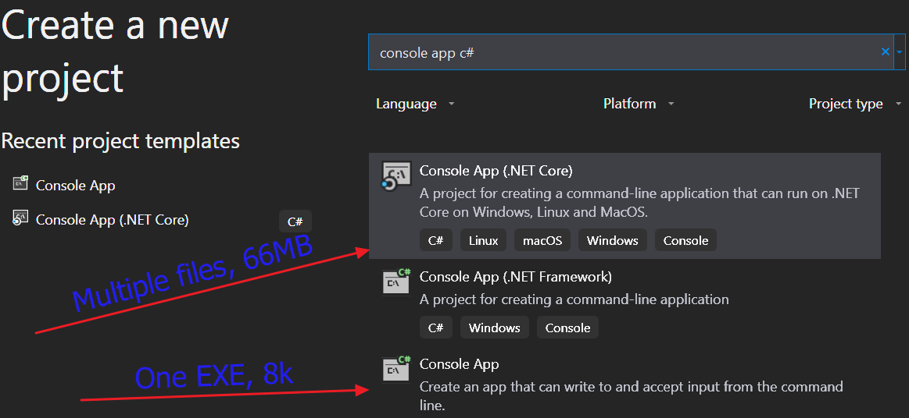

# EmptyFile - a program to empty (zero out) the files provided

## Syntax: emptyfile [/q][/?] [f:fileContainingFilenames][filename1] [filename2*] ...

### [/?] = Show this help

### [/q] = Dont ask yes or no on each file

### [filename1] = filenames of files to empty out

    *** Work In Progress ***

### [filename*] = Wildcard on file names

### [/f:fileContainingFilenames] = a file where each row contains one filename

# Reason for this program

When I move or decide to delete a file, I want the backups to be removed also.  I have two levels of backups and I don't want to have to log into everything just to kill those files also. 

SOooooo I just zero out the files. The backups copy the zero byte files into the back up places and the file is gone. 

I used to use a CMD file for this ....... 

    *** Then something happened *** 

For whatever oddity goes on in windows, my cmd file would zero out the file, then the file would return a few second later. 

# I decided it was time to learn a .net Core app with VS 2019

Guess what I learned ???? 

If you create a command line program which could be published to run in any environment, you only get a DLL, no EXE.  If you read up on this and discover how to publish a windows win64 EXE file, I ended up with 66MB of programs and DLLs.  I could find no way to just create a simple EXE file.  

# Discovered the old school EXE file.

Once I found an option to create an old school type win64 EXE file, I ended up with an 8k EXE file. See the two below ....

# Summary

I spent 15 minutes doing the program, having to lookup things in c# because I've not written c# for a year. I spent several hours trying to figure out how to create a simple EXE. 
